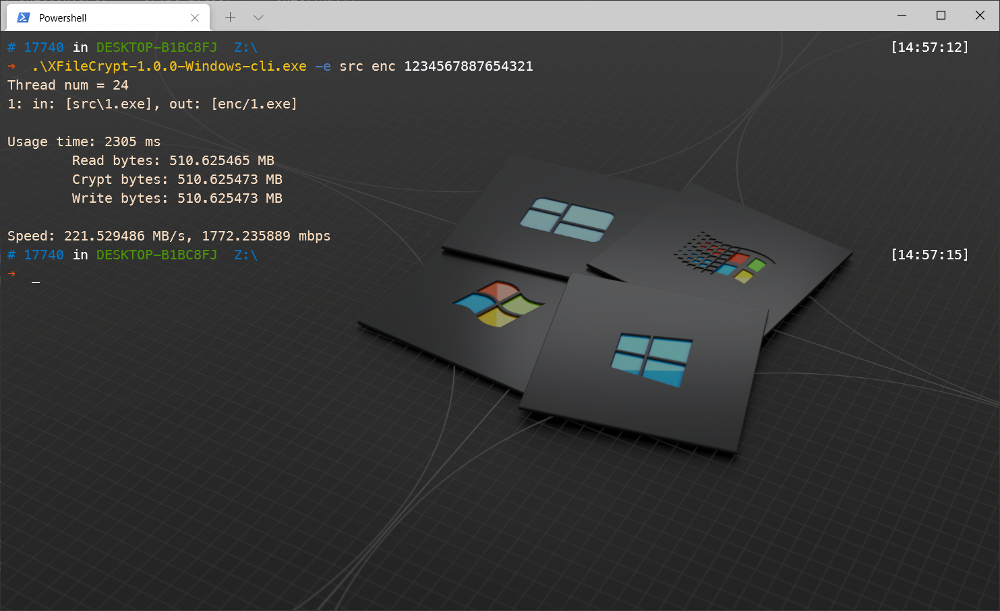
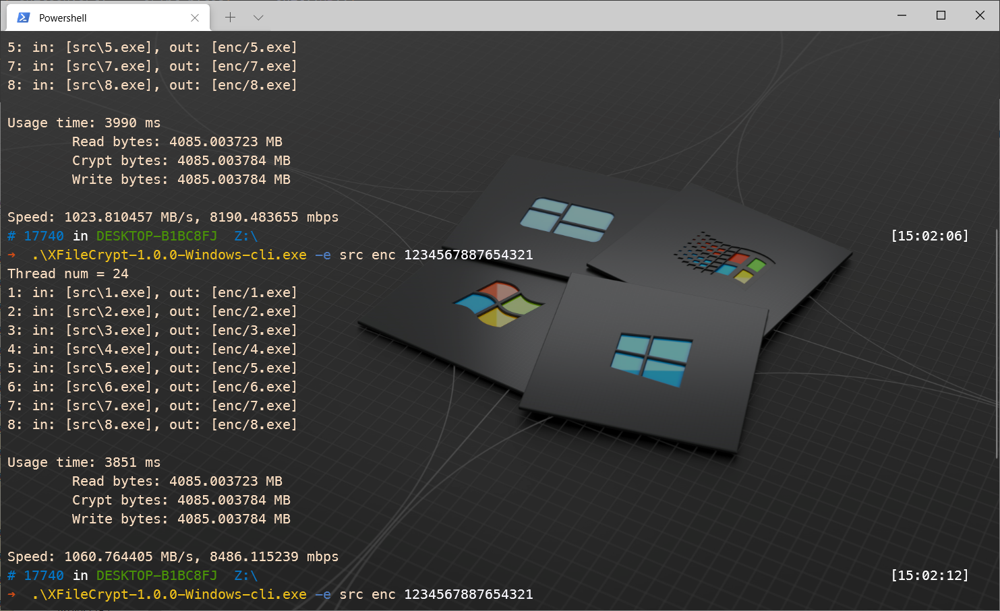

<div id="top"></div>

<!-- PROJECT SHIELDS -->
[![Contributors][contributors-shield]][contributors-url]
[![Forks][forks-shield]][forks-url]
[![Stargazers][stars-shield]][stars-url]
[![Issues][issues-shield]][issues-url]
[![License][license-shield]][license-url]
[![Build][build-shield]][build-url]

<!-- PROJECT LOGO -->
<br />

<div align="center">
<!--   <a href="https://github.com/hominsu/XFileCrypt">
    
  </a> -->

<h3 align="center">XFileCrypt</h3>

  <p align="center">
    多线程的文件加密程序
    <br />
    <a href="https://github.com/hominsu/XFileCrypt"><strong>Explore the docs »</strong></a>
    <br />
    <br />
    <a href="https://github.com/hominsu/XFileCrypt">View Demo</a>
    ·
    <a href="https://github.com/hominsu/XFileCrypt/issues">Report Bug</a>
    ·
    <a href="https://github.com/hominsu/XFileCrypt/issues">Request Feature</a>
  </p>
</div>

## Description

一个高性能的基于 C++17 和 OpenSSL 1.1.1 的多线程文件加密程序，加密模式采用 AES CBC 模式。密码一定要输入 16 位，否则程序会宕掉。原因是当输入不足 16 位时，会将 0 拷贝进 openssl 的 key_schedule 中，使用 AES 的时候会出错，但是 DES 不会。

- 单文件加密



- 多文件加密



## Details


## How To Use

- 查看版本:

  - `--version` or `-v`:

    ```shell
    ❯ ./XFileCrypt-1.0.0-Darwin-cli --version
    ❯ ./XFileCrypt-1.0.0-Darwin-cli -v
    ```
  
  - Output:
  
    ```shell
    XFileCrypt version 1.0.1
    
    XFileCrypt homepage url: https://github.com/hominsu/XFileCrypt
    ```
  
- 加解密：

  - 加密: `-e` 或者不输出详细加密文件信息 `-q -e`:

    ```shell
    ❯ ./XFileCrypt-1.0.0-Darwin-cli -e test/src test/enc 1234567887654321
    ❯ ./XFileCrypt-1.0.0-Darwin-cli -q -e test/src test/enc 1234567887654321
    ```
  
  - 解密: `-d` 或者不输出详细解密文件信息 `-q -d`:
  
    ```shell
    ❯ ./XFileCrypt-1.0.0-Darwin-cli -d test/enc test/dec 1234567887654321
    ❯ ./XFileCrypt-1.0.0-Darwin-cli -q -d test/enc test/dec 1234567887654321
    ```

  - Output:
  
    ```shell
    ❯ build/bin/XFileCrypt-1.0.1-Darwin-cli -e test/src test/enc 1234567887654321
    Thread num = 12
    1: in: [test/src/.DS_Store], out: [test/enc/.DS_Store]
    2: in: [test/src/test.txt], out: [test/enc/test.txt]
    3: in: [test/src/WechatIMG1.jpeg], out: [test/enc/WechatIMG1.jpeg]
    
    Usage time: 1 ms
            Read bytes: 0.067066 MB
            Crypt bytes: 0.067093 MB
            Write bytes: 0.067093 MB
    
    Speed: 67.066193 MB/s, 536.529541 mbps
    
    ❯ build/bin/XFileCrypt-1.0.1-Darwin-cli -q -d test/enc test/dec 1234567887654321
    Thread num = 12
    
    Usage time: 1 ms
            Read bytes: 0.067093 MB
            Crypt bytes: 0.067066 MB
            Write bytes: 0.067066 MB
    
    Speed: 67.092896 MB/s, 536.743164 mbps
    ```


<!-- MARKDOWN LINKS & IMAGES -->
<!-- https://www.markdownguide.org/basic-syntax/#reference-style-links -->

[contributors-shield]: https://img.shields.io/github/contributors/hominsu/XFileCrypt.svg?style=for-the-badge
[contributors-url]: https://github.com/hominsu/XFileCrypt/graphs/contributors
[forks-shield]: https://img.shields.io/github/forks/hominsu/XFileCrypt.svg?style=for-the-badge
[forks-url]: https://github.com/hominsu/XFileCrypt/network/members
[stars-shield]: https://img.shields.io/github/stars/hominsu/XFileCrypt.svg?style=for-the-badge
[stars-url]: https://github.com/hominsu/XFileCrypt/stargazers
[issues-shield]: https://img.shields.io/github/issues/hominsu/XFileCrypt.svg?style=for-the-badge
[issues-url]: https://github.com/hominsu/XFileCrypt/issues
[license-shield]: https://img.shields.io/github/license/hominsu/XFileCrypt.svg?style=for-the-badge
[license-url]: https://github.com/hominsu/XFileCrypt/blob/master/LICENSE
[build-shield]: https://img.shields.io/github/workflow/status/hominsu/XFileCrypt/Build%20Test?style=for-the-badge
[build-url]: https://github.com/hominsu/XFileCrypt/actions/workflows/build-test.yml

